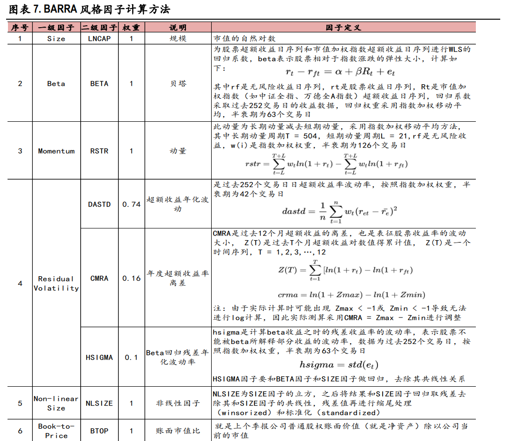
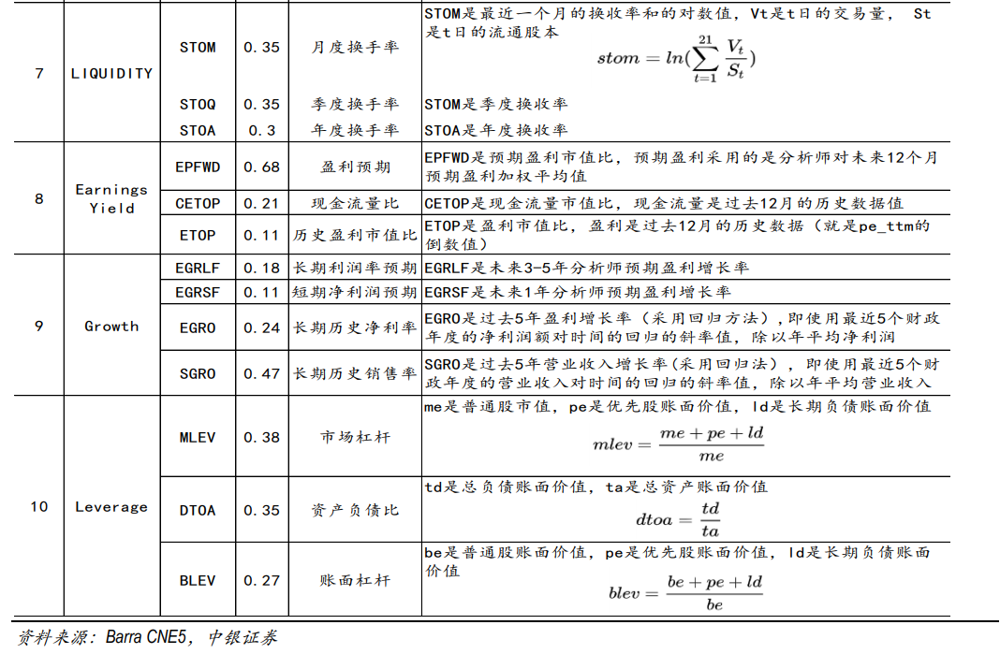

# Barra CNE5
## 1.前言
本文旨在记录自己在学习和使用Barra CNE5模型的过程，方便未来回忆。

## 2.CNE5模型简介

​		CNE5 是 Barra 的最新一代面向中国股票市场的多因子模型。**该模型考虑了一个国家因子、多个行业因子以及多个风格因子。**假设市场中共有 N 支股票，P 个行业，以及 Q 个风格因子。在任意给定时间点，该模型使用因子暴露和个股收益率构建**截面回归（cross-sectional regression）**如下：

$\begin{aligned} & {\left[\begin{array}{c}r_1-r_f \\ r_2-r_f \\ \vdots \\ r_N-r_f\end{array}\right]=\left[\begin{array}{c}1 \\ 1 \\ 1\end{array}\right] f_C+\left[\begin{array}{c}X_1^{I_1} \\ X_2^{I_1} \\ \vdots \\ X_N^{I_1}\end{array}\right] f_{I_1}+\cdots+\left[\begin{array}{c}X_1^{I_P} \\ X_2^{I_P} \\ \vdots \\ X_N^{I_P}\end{array}\right] f_{I_P}+\left[\begin{array}{c}X_1^{S_1} \\ X_2^{S_1} \\ \vdots \\ X_1^{S_1} \\ X_2^{S_Q} \\ \vdots \\ X_N^{S_Q}\end{array}\right] f_{S_Q}+\left[\begin{array}{c}u_1 \\ u_2 \\ \vdots \\ u_N\end{array}\right]}\end{aligned}$

​		其中 $r_n$ 是第 $\mathrm{n}$ 支股票的收益率， $r_f$ 是无风险收益率。 $X_n^{I_p}$ 是股票 $\mathrm{n}$ 在行业 $I_p$ 的暴露，如果假设一个公司只能属于一个行业，那么 $X_n^{I_p}$ 的取值为 0 (代表该股票不属于这个行业) 或者 1 (代表该股票属于这个行业)。 $X_n^{S_q}$ 是股票 $\mathrm{n}$ 在风格因子 $S_q$ 的暴露，它的取值经过了某种标准化
（标准化的方法会在下文说明）。 $u_n$ 为股票 $\mathrm{n}$ 的超额收益中无法被因子解释的部分，因此也被称为该股票的特异性收益。 $f_C$ 为国家因子的因子收益率（所有股票在国家因子上的暴露都是1）； $f_{I_p}$ 为行业 $I_p$ 因子的因子收益率; $f_{S_q}$ 为风格因子 $S_q$ 的因子收益率。

​		对于给定某一期截面数据（记为 $\mathrm{T}$ 期），在截面回归时，Barra 采用期初的因子暴露取值（等价于 $\mathrm{T}$ - 1 期期末的因子暴露取值) 和股票在 T 期内的收益率进行截面回归。在 USE4 模型中，因子收益率是日频的，因此截面回归也应该是日频的，所以按照上述说明，在 $T-1$ 日结束后更新因子的暴露，并利用 T 日的股票收益率和因子暴露做截面回归。以下说明来自 Barra Risk Model Handbook。

## 3.Barra10因子

# 4.Barra10因子的作用

​	在得到因子之后，可以从时序上，观察因子值、pnl时序上与10因子的相关系数，来反应该因子在不同风格上的暴露。
​	此外，还可以考虑加入20DR观察该因子对股价反转因子的暴露。

# 5.风格？因子？

​	什么是风格因子，什么是异象因子呢？换言之，我们能否自行选择合适的风格因子来检验某一因子在该方面的风险暴露程度，这个问题值得继续研究。之前在刷研报的时候，似乎也有研究员对size市值因子到底是算风格还是一个市场异象进行过讨论，但是笔者写到这里的时候不记得了（2024-1-29 22:46:26），将带着这个问题继续学习~

## 参考文献

1.[正确理解 Barra 的纯因子模型](https://zhuanlan.zhihu.com/p/38280638)