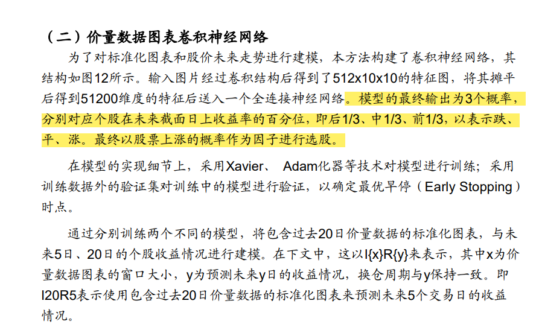

# 1.AlexNet识别K线

## 模型的结构


## Code

```python
import torch
from torch import nn

net = nn.Sequential(
    # 这里使用一个11*11的更大窗口来捕捉对象。
    # 同时，步幅为4，以减少输出的高度和宽度。
    # 另外，输出通道的数目远大于LeNet
    nn.Conv2d(1, 96, kernel_size=11, stride=4, padding=1), nn.ReLU(),
    nn.MaxPool2d(kernel_size=3, stride=2),
    # 减小卷积窗口，使用填充为2来使得输入与输出的高和宽一致，且增大输出通道数
    nn.Conv2d(96, 256, kernel_size=5, padding=2), nn.ReLU(),
    nn.MaxPool2d(kernel_size=3, stride=2),
    # 使用三个连续的卷积层和较小的卷积窗口。
    # 除了最后的卷积层，输出通道的数量进一步增加。
    # 在前两个卷积层之后，汇聚层不用于减少输入的高度和宽度
    nn.Conv2d(256, 384, kernel_size=3, padding=1), nn.ReLU(),
    nn.Conv2d(384, 384, kernel_size=3, padding=1), nn.ReLU(),
    nn.Conv2d(384, 256, kernel_size=3, padding=1), nn.ReLU(),
    nn.MaxPool2d(kernel_size=3, stride=2),
    nn.Flatten(),
    # 这里，全连接层的输出数量是LeNet中的好几倍。使用dropout层来减轻过拟合
    nn.Linear(6400, 4096), nn.ReLU(),
    nn.Dropout(p=0.5),
    nn.Linear(4096, 4096), nn.ReLU(),
    nn.Dropout(p=0.5),
    # 最后是输出层。由于这里使用Fashion-MNIST，所以用类别数为10，而非论文中的1000
    nn.Linear(4096, 10))
```

# 2.Paper

[JIANG, J., KELLY, B. and XIU, D. (2023), (Re-)Imag(in)ing Price Trends. J Finance, 78: 3193-3249. ](https://papers.ssrn.com/sol3/papers.cfm?abstract_id=3756587)

### Abstract

我们重新考虑了基于趋势的可预测性的想法，使用的方法是灵活学习最能预测未来回报的价格模式，而不是测试假设的或预先指定的模式（例如，动量和反转）。我们的原始预测数据是图像——股票级别的价格图表——我们使用机器学习图像分析方法从中诱导出最佳预测回报的价格模式。我们识别出的预测模式与文献中常分析的趋势信号大不相同，它们提供了更准确的回报预测，转化为更有利可图的投资策略，并且对一系列规范变化具有鲁棒性。这些模式还表现出与环境无关的特性：在短时间尺度（例如，日常数据）估计的预测模式，当应用于更长的时间尺度（例如，月度）时，同样能给出强有力的预测，从美国股市学到的模式在国际市场上同样能够很好地预测。

## 2.1 原论文的input data

**数据集：** CRSP数据库中纽约证券交易所（NYSE）、美国证券交易所（AMEX）和纳斯达克（NASDAQ）上市的所有公司的每日股票数据。包括每日开盘价、最高价、最低价和调整后的收盘价。

**数据集区间：** 从1993年至2019年。

**时间长度：** 数据覆盖了27年的股市交易数据。

**数据使用细节：**

- **价格调整：** 第一天的收盘价标准化为1，后续每天的收盘价根据日收益率计算。
- **标签定义：** 使用过去5天、20天或60天的市场数据图像，标签基于图像后的5天、20天或60天内的收益率是正还是非正。

**训练和测试细节：**

- **数据划分：** 1993年至2000年的数据用于训练和验证（70%训练，30%验证），2001年至2019年的数据用作固定测试集。
- **模型训练：** 采用CNN模型，每种模型配置独立训练五次并平均预测结果。

> We use daily stock data from CRSP for all firms listed on NYSE, AMEX, and NASDAQ. Our sample runs from 1993–2019 based on the fact that daily opening, high, and low prices first become available in June 1992. Our price trend analysis focuses on returns adjusted for corporate actions by using returnsto construct a price series. In each image, we normalize the first day closing price to one, and construct each subsequent daily close from returns (RETt) according to
>
> 
>
> Each day’s opening/high/low price levels are scaled in proportion to that day’s closing price level. 
>
> We consider three input choices that include images of market data over the past 5, 20, or 60 days. Image labels take a value of one or zero for positive or non-positive returns over the 5, 20, or 60 days subsequent to the image. Thus, our main analysis amounts to nine separately estimated models. Because the CNN optimization is stochastic, for each model configuration we independently re-train the CNN five times and average their forecasts (following Gu et al., 2020). 
>
> Two important considerations when reading our empirical results are that we do not recursively re-train the model and that we randomly select training and validation samples. Specifically, we train and validate each model only once using data from 1993 to 2000, in which 70% of the sample are randomly selected for training and the remaining 30% for validation. The trained CNN model is then held fixed for the entire 2001 to 2019 test sample. This design is primarily due to capacity in computational resources. Adopting a rolling window and repeatedly retraining is likely to further improve the predictions.
>
> Every period in which we construct new forecasts (weekly, monthly, or quarterly, depending on the model’s forecast horizon), we sort stocks into decile portfolios based on out-of-sample CNN estimates for probability of a positive subsequent return. We also construct a long-short spread portfolio (“H-L”) that is long decile 10 and short decile 1. The holding period for each portfolio coincides with the forecast horizon for each model (either 5, 20, or 60 days following the last date in an image). Throughout we use the notation “Ix/Ry” to denote that the model uses x-day images to predict subsequent y-day holding period returns.
>
> 

## 2.2 train 方法

我们从训练到模型调整，最后到预测的工作流程遵循 Gu et al. (2020)概述的基本程序。首先，我们将整个样本分为训练样本、验证样本和测试样本。在我们的主要美国数据样本中，我们在样本开始时使用单个八年样本（1993-2000）来估计和验证模型。在这个八年样本中，我们随机选择 70% 的图像进行训练，30%  的图像进行验证。随机选择训练和验证样本有助于平衡分类问题中的正标签和负标签，从而减轻由于长期看涨或看跌市场波动而导致的分类潜在偏差。在我们考虑的所有场景中，生成的训练和验证图像的标签大约有 50% 向上和 50% 向下。剩余十九年（2001-2019）的数据构成样本外测试数据集。

### Loss Function


### Hyperparameters

1. **初始权重分布**：使用Xavier初始化器（Glorot and Bengio, 2010）设置每层的权重初始值，以确保预测的方差与标签的方差开始时处于相似的规模。
2. **学习率**：在使用随机梯度下降和Adam算法（Kinga and Adam, 2015）进行损失函数优化时，初始学习率设为1 × 10^-5。
3. **批量大小**：批量大小设为128。
4. **批量正规化**：在每个构建块中的卷积层和非线性激活层之间使用批量正规化层（Ioffe and Szegedy, 2015），以减少协变量偏移。
5. **Dropout率**：在全连接层应用50%的dropout（Srivastava et al., 2014），以减少过拟合。
6. **早停机制**：使用早停（early stopping）策略，在验证样本的损失函数连续两个训练周期不再改善时停止训练。

> We adopt the same regularization procedures in Gu et al. (2020) to combat overfit and aid efficient computation. We apply the Xavier initializer for weights in each layer (Glorot and Bengio, 2010). This promotes faster convergence by generating starting values for weights to ensure that prediction variance begins on a comparable scale to that of the labels. Loss function optimization uses stochastic gradient descent and the Adam algorithm (Kinga and Adam, 2015) with initial learning rate of 1 × 10−5 and batch size of 128. We use a batch normalization (Ioffe and Szegedy, 2015) layer between the convolution and non-linear activation within each building block to reduce covariate shift.7 We apply 50% dropout (Srivastava et al., 2014) to the fully connected layer (the relatively low parameterization in convolutional blocks avoids the need for dropout there). Finally, we use early stopping to halt training once the validation sample loss function fails to improve for two consecutive epochs. Gu et al. (2020) outline the intuition behind these choices, so for the sake of brevity, we omit this discussion and instead refer interested readers there.

# 3.广发 安宁宁

### 1.input data

要自己生成，可以自己加入技术指标、OHLC价格、Volume等。但是可能会数据量很大。

### 2.模式的structure可以按照alexnet or 安宁宁的

|                           AlexNet                            |                            安宁宁                            |
| :----------------------------------------------------------: | :----------------------------------------------------------: |
|  |  |

### 3.output

模型的最终输出为3个概率， 分别对应个股在未来截面日上收益率的百分位，即后1/3、中1/3、前1/3，以表示跌、 平、涨。最终以股票上涨的概率作为因子进行选股。

**也许可以对收益率分箱，进行更多分类，转化为预测涨跌幅度而非概率。**

## 原文：

> 
>
> 
>
> 
