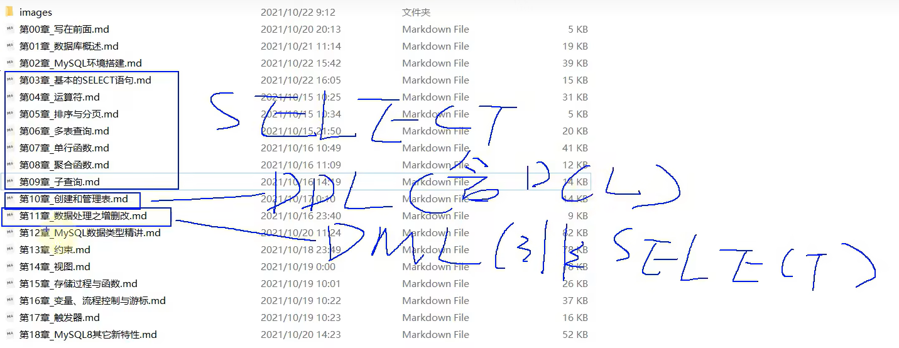
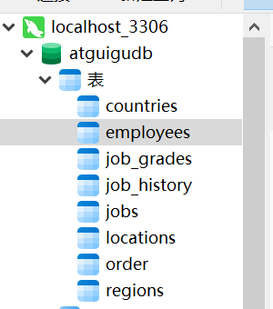
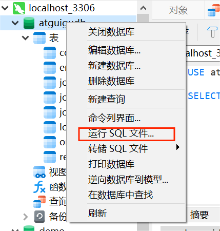

**本文用来记录DBMS小白学习MySQL的过程**。

学习资源链接：https://www.bilibili.com/video/BV1iq4y1u7vj?p=12&vd_source=44ba9a7b92cb9c058705d88870afca92

## 学习主线：



# 第03章_基本的SELECT语句（SELECT非常重要）

## SQL的分类

DDL:数据定义语言。CREATE \ALTER \DROP \RENAME \ TRUNCATE
DML:数据操作语言。INSERT \DELETE \UPDATE \SELECT
DCL:数据控制语言。COMMIT \ROLLBACK \SAVEPOINT \GRANT \REVOKE

查询和更新指令构成了 SQL 的 DML 部分（**增删改查**）：

- `INSERT INTO` - 向数据库表中插入数据 
- `DELETE` - 从数据库表中删除数据 
- `UPDATE` - 更新数据库表中的数据 
- `SELECT` - 从数据库表中获取数据 

SQL 的数据定义语言 (DDL) 部分使我们有能力创建或删除表格。我们也可以定义索引（键），规定表之间的链接，以及施加表间的约束。

SQL 中最重要的 DDL 语句: 

- `CREATE DATABASE` - 创建新数据库 
- `ALTER DATABASE` - 修改数据库 
- `CREATE TABLE` - 创建新表 
- `ALTER TABLE` - 变更（改变）数据库表 
- `DROP TABLE` - 删除表 
- `CREATE INDEX` - 创建索引（搜索键） 
- `DROP INDEX` - 删除索引 

## SQL的数据导入方法

### 如果是使用cmd命令行

```cmd
mysql -u root -p # 进入mysql数据库
source #文件
use aiguigudb #运行sql文件，show tables;即可看到各表
```

### 使用Navicat时



右键图中atguiggudb，运行SQL文件



然后刷新，表就会更新。
