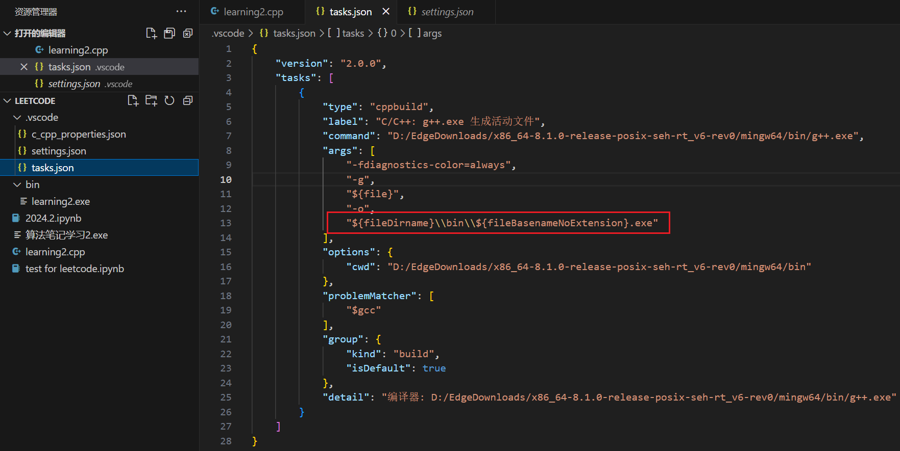

# 从零开始在vscode上配置C++运行环境

​		本文用于记录我在配置C++时遇到的坑。之前在配置的时候是花钱找tb帮忙做的，这次打算记录下来这个过程，以便后续复现。

## 1.安装MinGW编译器

​		需要从[SourceForge.net](https://sourceforge.net/projects/mingw-w64/files/mingw-w64/mingw-w64-release/)处下载MinGW编译器.

### 1.1 选择合适的版本


### 1.2 配置系统环境

将\bin的文件路径（比如我的是D:\EdgeDownloads\x86_64-8.1.0-release-posix-seh-rt_v6-rev0\mingw64\bin）添加入电脑系统环境


### 1.3 验证是否成功安装

打开cmd，输入`gcc -v`


出现上述内容说明安装成功

## 2.在vscode中安装C/C++插件


## 3.配置C/C++环境


可以先建立 .vscode文件夹

### 3.1 配置编译器

**（在.vscode文件夹含有c_cpp_properties.json文件）**

首先按快捷键Ctrl+Shift+P调出命令面板，输入C/C++，选择“Edit Configurations(UI)”进入配置。

接着这里配置两个选项： - 编译器路径：

```text
D:/mingw-w64/x86_64-8.1.0-win32-seh-rt_v6-rev0/mingw64/bin/g++.exe
```

这里的路径根据大家自己安装的Mingw编译器位置和配置的环境变量位置所决定。


第一步


第二步


第三步

配置完成后，此时在侧边栏可以发现多了一个.vscode文件夹，并且里面有一个c_cpp_properties.json文件，内容如下，说明上述配置成功。现在可以通过**Ctrl+`快捷键**打开内置终端并进行编译运行了。（ESC下边的`）

**c_cpp_properties.json**

```jsonld
{
    "configurations": [
        {
            "name": "Win32",
            "includePath": [
                "${workspaceFolder}/**"
            ],
            "defines": [
                "_DEBUG",
                "UNICODE",
                "_UNICODE"
            ],
            "windowsSdkVersion": "10.0.17763.0",
            "compilerPath": "C:\\Program Files\\mingw64\\bin\\gcc.exe",
            "cStandard": "c17",
            "cppStandard": "c++17",
            "intelliSenseMode": "gcc-x64"
        }
    ],
    "version": 4
}
```


### 3.2 配置构建任务

**（在.vscode文件夹中创建一个tasks.json文件）**

该任务将调用g++编译器基于源代码创建可执行文件。 按快捷键Ctrl+Shift+P调出命令面板，输入tasks，选择“Tasks:Configure Default Build Task”：


第一步哟

再选择“C/C++: g++.exe build active file”：


第二步呀

此时会出现一个名为tasks.json的配置文件，内容如下：

```json
{
    // See https://go.microsoft.com/fwlink/?LinkId=733558 
    // for the documentation about the tasks.json format
    "tasks": [
        {//构建配置项
            "type":"shell",//任务类型,Vscode将预定义变量转义解析后直接传给command;shell->先打开shell再输入命令,因此args会经过shell再次解析
            "label": " "g++.exe build active file"",//任务名称
            "command": "C:\\Program Files\\mingw64\\bin\\gcc.exe",//记得修改本地编译器路径
            "args": [ //包含传给gcc命令的参数,用于实现特定功能
                "-g", //生成和调试有关的信息
                "${file}", //指定编译文件为当前文件
                "-o",//指定输出文件的路径和名称
                //"${fileDirname}\\${fileBasenameNoExtension}.exe"
                "${workspaceFolder}\\build\\${fileBasenameNoExtension}.exe"//修改.exe文件生成位置
            ],
            "options": {
                //"cwd": "${fileDirname}"
                "cwd": "C:\\Program Files\\mingw64\\bin"
            },
            "problemMatcher": [
                "$gcc"
            ],
            "group": {//包含很多task,归为group
                "kind": "build",//表名该组任务类型是构建
                "isDefault": true//表明此任务为此组任务中的默认任务
            },
            "detail": "调试器生成的任务。"
        }
    ],
    "version": "2.0.0"
}
```


可以参考一下

（本部分参考：[【详细版】VsCode搭建C++环境 - 知乎 (zhihu.com)](https://zhuanlan.zhihu.com/p/545908287)）

---

**此时，已经可以正常运行和调试.cpp的文件了！**


但是此时编译好的.exe后缀文件会保存在原代码的位置，看起来非常的丑！


我们希望把.exe文件放到bin文件夹中

### 3.3 设置输出编译后文件至某一文件夹



把这一行代码的输出改为如图所示。


**成功！**
