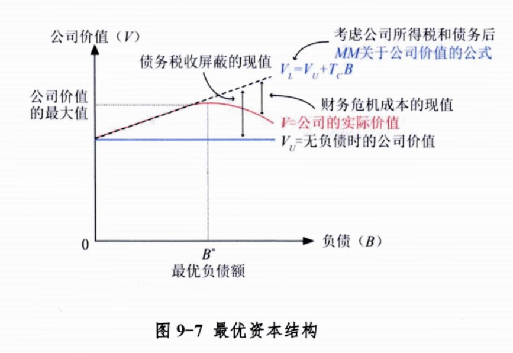
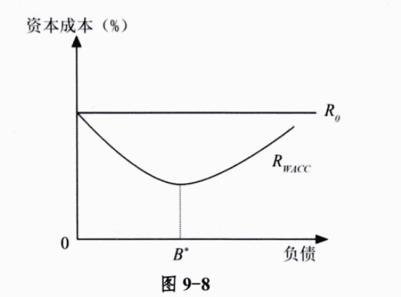
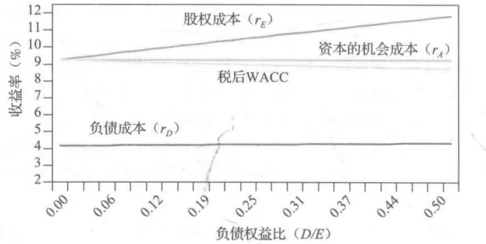

# 公司金融知识点

## 影响$\beta$的几个因素（三个都是同向的）

### 周期性

### DOL（Degree of Operating Levergae)

$$
D O L=\frac{\Delta E B I T / E B I T}{\Delta Q / Q}
$$

其中，Q为产销量
$$
D O L=\frac{E B I T+F C}{E B I T}
$$
FC是 总固定成本

### DFL（Degree of Financial Leverage）

$$
D F L=\frac{\Delta E P S / E P S}{\Delta E B I T / E B I T}
$$

其中，EPS是Earing Per Share，为本期税后净利润/正发行在外的普通股加权平均数

EBIT为Earing Before Interest and Tax，为净利润+利息+税
$$
D F L=\frac{E B I T}{E B I T-I}
$$
其中，I为利息

## MM定理

### 无税

1.资本结构不影响公司价值
$$
\text { 公司价值 = 负债的市场价值 }+\text { 权益的市场价值 }
$$
2.股权的期望收益率 $r_E$ 和公司的杠杆结构 $\frac{D}{E}$ 成正比，比例系数为$r_A-r_D$

### 有税

1.
$$
\text { 公司价值 = 全股权融资时的价值 }+P V \text { (税盾) }
$$

2.

公司利息支付有税盾时，随负债增加，税后的WACC下降

## 考虑有税的MM定理出现的三大结论

### 权衡理论（静态权衡理论）

把税盾效应和破产成本考虑进来，企业就会有一个最优的股权和债券融资比例，这边是资本结构的<u>**权衡理论**</u>

#### **定义**

公司在进行资本结构决策时，会权衡税盾的好处与财务困境成本，**最大化公司价值**。这种方法般被称为资本结构的权衡理论或静态权衡理论。（这边的公司价值实际上是指市场性索取权的价值）

#### 图解

上图展现了理论上的最优资本结构。税盾增加杜杆公司的价值, 财务困境成本降低杜杆公司的价 值。两个因素互相抵消, 在 $B^*$ 点产生最优债务额。

#### 税收对加权平均资本的影响

根据静态权衡理论， $\boldsymbol{R}_{W A C C}$ 首先因为税盾的好处而下降。超过 $B^*$ 点后， $\boldsymbol{R}_{W A C C}$ 开始财务困境成本 而上升。

### 优序融资理论

##### 定义

优序融资理论亦译 “啄食顺序理论”。以信息不对称理论为基础, 并考虑交易成本的存在。公司 在为投资项目筹集资金时, 首先选择内部融资, 其次才考虑外部融资; 如果需要进行外部筹资, 公司 将首先选择高等级债务工具, 然后选择低等级债务工具, 例如可转换债券与可转换优先股, 最后才选 择普通股票。

##### 融资法则

**(1) 法则 1:** 采用内部融资
管理者在给权益和债务定价时, 都要担心投资者的怀疑态度, 因此先考虑内部融资。

**(2) 法则 2:** **先发行最稳健的证券**
与权益相比, 公司债务具有相对较小的风险, 因此, 需要外部融资时, 先发行稳健的债券, 在公 司达到一定的负债水平后再发行权益, 此外, 发行直接债务应先于发行可转换债, 最后再是股权。

**(3) 理论特点**
(1)不存在财务杠杆的目标值, 财务杜杆总额根据可利用项目随即决定。

### 信号理论

管理层改变公司杜杆时, 会传递某些信息。一般认为, 当管理层提高杜杆时, 意味着公司前景较好, 公司价值会提高。

#### 理性世界

理性的企业预计其盈利将增加时, 会提高其负债水平; 理性的投资者把负债作为公司价值的一个信号, **负债越多, 公司价值越高。**

#### 管理层愚弄投资者

管理层愚弄投资者的动机一一公司可以通过承担额外的负债来愚弄投资者, 使投资者认为公司价值比实际的更大。但这种行为会增加成本, 使股价下跌。在管理层不会愚弄投资者的世界里, 价值高 的公司比价值低的公司发行更多的债券, 投资者把发债作为公司价值的正信号。

## 金融摩擦（financial frictions)

信息不对称、期限错频、交易成本

### 信息不对称

1. 事后——道德风险
2. 事前——逆向选择

### 委托代理

掌握信息的代理方

没有掌握信息的委托方
