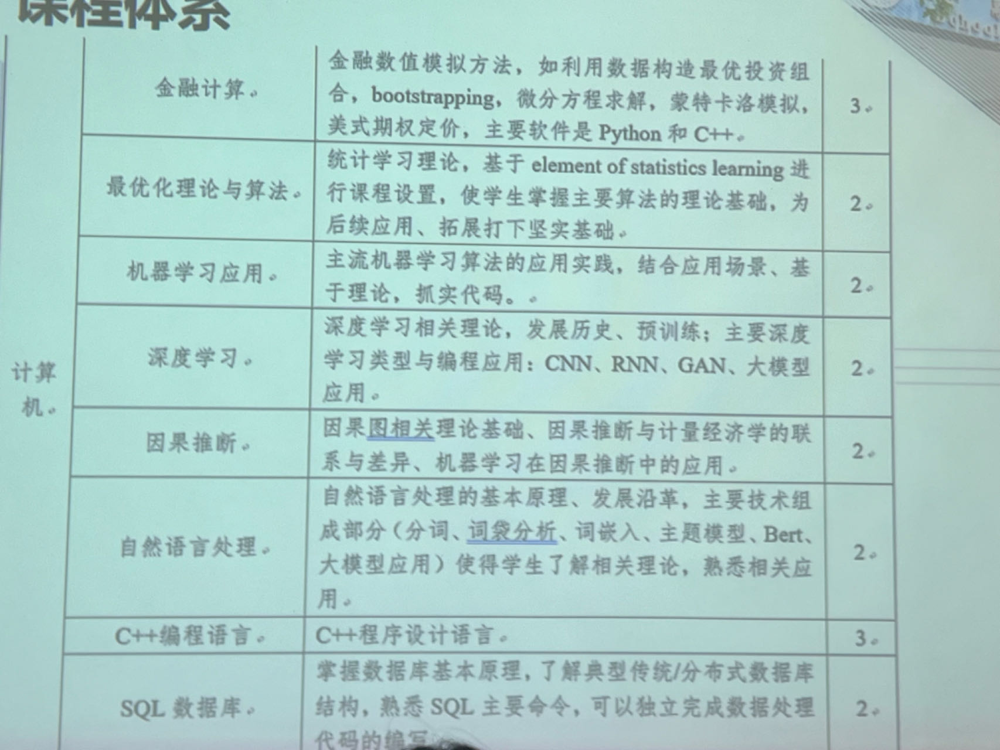
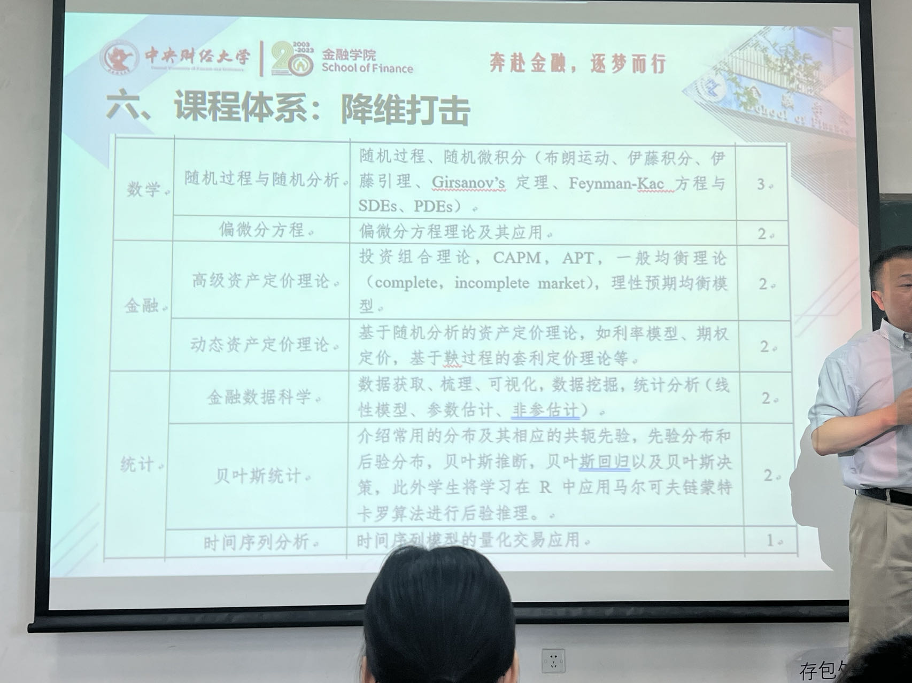

# 关于选校的一些想法
本来是打算好好学习MySQL和数据结构的，但是忽然入了贸大的量化投资方向，一下子要重新拿起尘封许久的数三和英语书，居然还要做PPT进行答辩，而且是在生日那天一大早背井离乡地进京赶考，不禁让我高强度刷xhs思考“我真的需要这份offer吗”

所以！

**我打算写下来一些我现在的想法，以便在2023年9月29号填系统的时候，帮助我进行选择。**

## 央财的课程安排

---
我的目标一定不是留在北京，而是利用在央财这段时间尽量打好机器学习的理论基础，把C++、DL、ML、optimization、SQL给学明白。尽早开始打kaggle比赛，以弥补因为地理位置而耽误的实习不足的问题。

**那么我为什么要去贸大呢！**

因为我真的好不放心央财！！！我是量化投资方向的小白鼠！如果发现因为实习导致找不到quant工作且家里不支持我去hk和坡，我就真得去银行了……我还是很想了解一下贸大的**考核难度、课程设置、实习安排和毕业生去向**的，而这些我在网上真的找不到相关的回答，看他们公布的去向都是四五年之前了（那时投行还是版本答案呢）。

写到这里，其实我已经做出了offer的选择，但是我一定不会浪费这笔支出，指定得把我看不出来的**央财的培养方案的不足**给挖出来，并且我得搞明白**哪些是需要从实习中学到的，哪些是可以通过科研替代学习来掌握的**，我认为掌握了这些问题的答案，是足以帮助我做出一个让我不会后悔的选择。

btw，千万不要“因为不喜欢A，而选择B”。