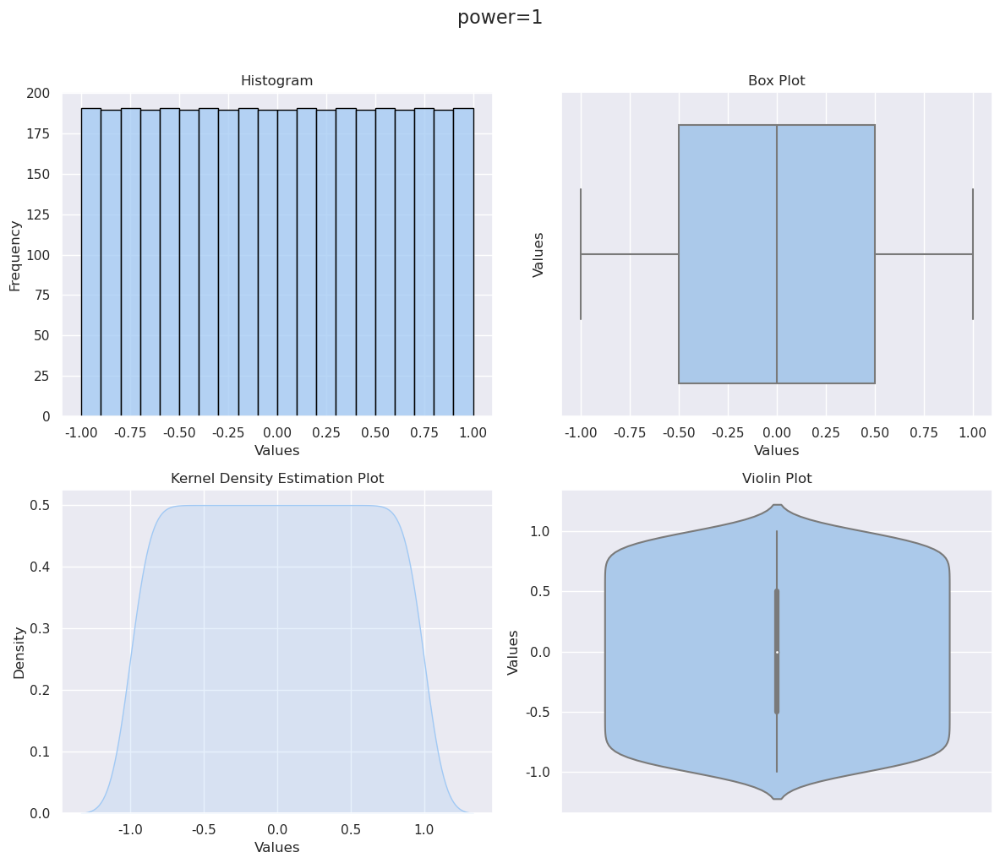
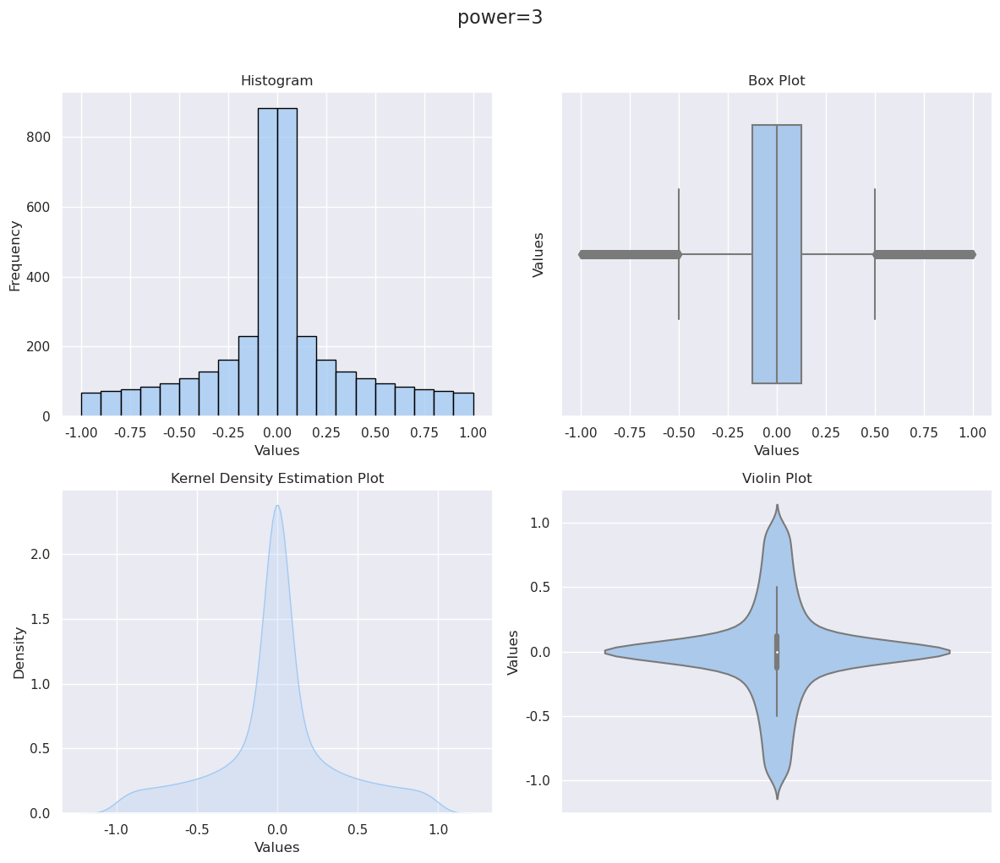
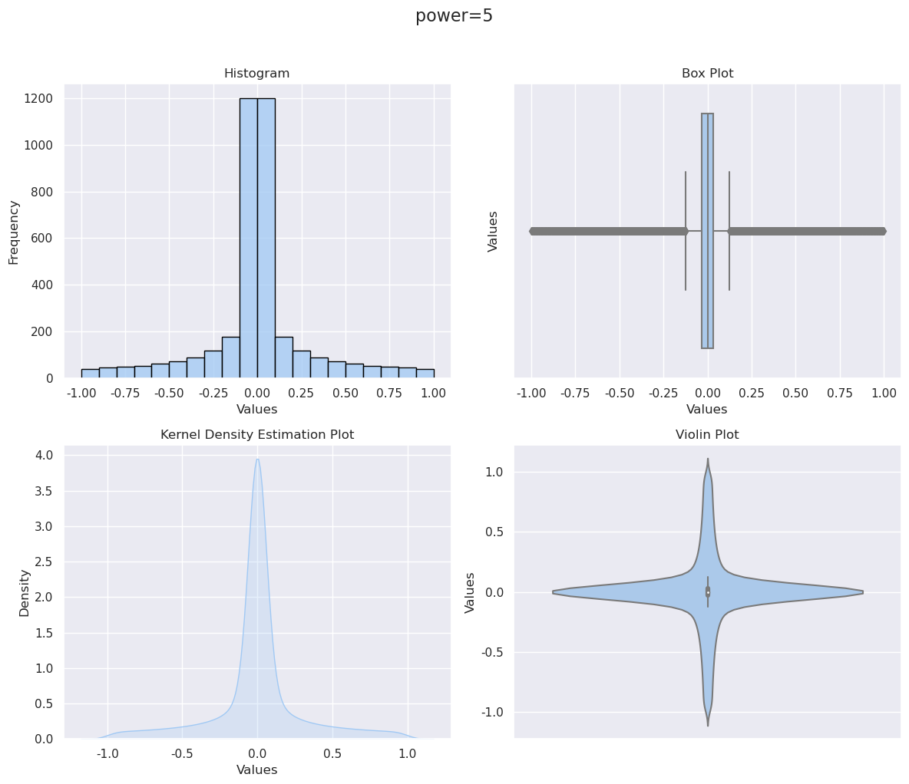

## 1.如何根据市场交易规则（最小交易单位）来执行计算出的交易信号。

(考虑交易手数的话，需要解一个以最小化持仓误差为目标函数的、以总资金为硬约束的整数线性规划问题)

## 2.利用alpha值生成持仓信号
在利用经过行业市值中性化、过滤掉涨跌停的final alpha values计算对应的持仓比例、多空持仓情况时，可以考虑使用power rank。
```python
def cal_cs_rank(x, maxvalue=None,minvalue=None):
    '''
    部分经过删除处理
    '''
    res = np_nan_array(shape = (x.shape[0],), dtype="float64")
    res = (res - np.nanmin(res)) / (np.nanmax(res) - np.nanmin(res)) * (maxvalue - minvalue) + minvalue
    return res  
```
具体是把因子先利用rank函数展成(-1,1)的均匀分布形式，再根据对于头部权重的考虑，对展开后的值取3次方、5次方。

### 1次方就是均匀分布

```python
plot_distribution(Analyzer.industry_analyze_detail('2021-03-29')['factor'].values,'power=1')
```




2

| power=3                                   | power=5                                   |
| ----------------------------------------- | ----------------------------------------- |
| ```plot_distribution(tmp**3,'power=3')``` | ```plot_distribution(tmp**5,'power=5')``` |
|      |      |

## 3.回测计算的是单利
```python
df['ac_returns'] = df['returns'].cumsum()