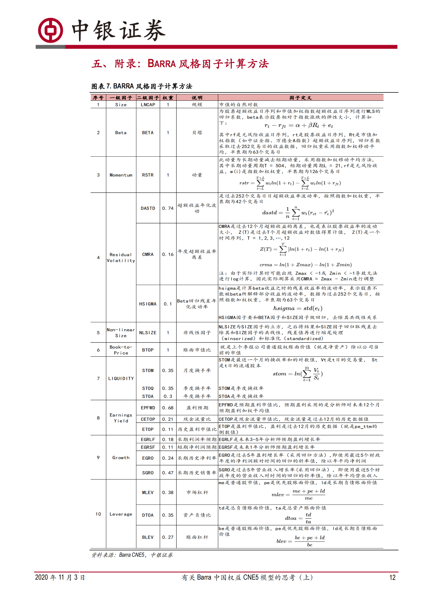

# 实习思考

## 前言

​	本文用来记录我在第一段量化实习中的思考，以及由此产生的关于学习方向的灵感。
​	update：2024-1-16 00:10:57，最近和带教老师还有机器学习组的同事交流了一下，感觉量化的底层就是将多个不同频率信号的合成为一个超因子，在这个过程之后再基于金融、经济学的先验知识，对这个因子做风格、行业、换手率等方面的约束，**信号合成**才是关键。

## 一、对于整体

​	“量化投资始终坚持以基本面为核心，同时结合价量信息的方式，立足从投资的本源看问题，以长期有效的逻辑出发构建基础框架，再与交易逻辑相融合。无论是基本面还是价量，对每一类信息都会深挖背后的逻辑与含义，在此基础上，采用传统数学建模与领先的人工智能和机器学习技术结合的方式，不断随着市场结构与交易行为进行优化迭代。”

1.是如何将基本面因子与量价因子结合的，使用有效前沿吗？

2.交易逻辑+基础框架，是指因子组合之后划分为某个风格框架吗？

3.因子表现较好的作为多因子框架的因子，表现较差的作为机器学习模型的因子吗？这两者是如何结合的呢，也是划分为某个风格的吗？如何判断市场结构和交易行为，这是涉及到根据微观结构调整权重吗？

## 二、挖因子

1.对于中低频的基本面因子，正确的挖掘模式是什么样的呢，有哪些挖掘方法，效率如何？

2.对于高频因子，如何判断因子是处于正常波动还是失效的状态

A:绩效归因

3.如何在收益率和可解释性（逻辑性）进行取舍

A:可解释性，以及如果sharpe够大也能直接怼。

## 三、因子组合

1.看完石川《因子投资方法与实践》后写

2.可以使用机器学习做组合优化。

> 经典的多因子研究包括 alpha 因子的挖掘和期货组合权重优化计算。市面常见的逻辑认为：任意期货都同时暴露于多种不同的风险因素下，这些风险因素的共同作用形成了期货合约价格的波动。通过对不同的风险因素以 alpha 因子的形式有效刻画，我们可以实现对期货收益率的分解，从而研究期货合约价格波动的原因。而最优的投资组合则应当是经过“剔除其余不稳定的因素干扰、充分暴露于 alpha 因子，并一般通过凸优化方法将对收益率的预测转化为组合权重”等若干步处理后的结果。这些步骤中也涉及到一些针对组合权重的约束条件的设置。

技术栈：`凸优化层 cvxpylayers`

简要来讲，它是一 个 python 库，在 CVXPY 的基础上整合了PyTorch、JAX和 TensorFlow 的接口， 便于用户在构造神经网络时来调用这些框架里的层以及建立可分的凸优化层。

3.要去计算single factor & portfolio和Barra10因子的相关系数。

## 四、交易信号

### 1.交易信号的分布需要服从norm吗？

A：需要具体情况具体分析，比如需要分析异常值对应的标的是什么类型的。对于偏态厚尾信号的处理，可以使用power rank，展成均匀分布后根据表现改变power分配头部alpha的权重。-2023.11.27

### 2.根据计算出的alpha值如何分配position？

A：INSN、过滤invalid pool后，对pwrk的alpha值的非nan值的头部50%做多、尾部50%做空。

目的：portfolio多空平衡、行业市值中性 ，尽量减少beta和在传统风格因子上的暴露。

## 五、回测框架

vn.py、Backtrader

**~~争取在2024年前使用backtrader跑一次回测~~**	已完成-2023.11.27

## 六、绩效归因

Brison框架

## 七、宏观择时框架

基于周期理论、宏观数据，划分金融市场属于哪个时域（用Regime Switching、HMM类似思想的ML、RL模型）

针对这个问题，优先了解**Temporal Routing Adaptor（TRA）**模型。

> 针对股票收益率预测任务，采用**Temporal Routing Adaptor（TRA）模型**，用以识别不同的交易模式，直面“市场规律具有时变特性”这一核心问题。期望为每只股票，在每个时刻，都能找到与之相适应的股票收益率预测器或预测器组合，从而达到更优的预测效果。为了防止输出结果集中在个别预测器，借鉴了最优传输问题（OT）来指导路由器的学习。
>
> TRA模型最早由微软亚洲研究院在 2021 年 6 月发布于 arXiv ，并被 2021 年 KDD国际数据挖掘与知识发现大会接收。原模型代码已经封装在QLib里，感兴趣的投资者可以自行下载测试。本文在原模型基础上进行修改和优化。

[【专题研究】DFQ-TRA：多交易模式学习因子挖掘系统 (qq.com)](https://mp.weixin.qq.com/s/pSdRtVVegwn5w5tu3IIreQ?poc_token=HOYAeGWjlNdg2VF8t711Tsb2T_4ztnGQDu24dHle)

 [国泰君安_20220511_主动专题报告_“板块配置轮盘”之初探——尝试搭建宏观因子和A股板块轮动间的桥梁_王大霁王鹤_20220511.pdf](实习思考\国泰君安_20220511_主动专题报告_“板块配置轮盘”之初探——尝试搭建宏观因子和A股板块轮动间的桥梁_王大霁王鹤_20220511.pdf) 

## 八、RL调参

通过RL模型，选择合适的训练长度和预测长度，并且学习对应的可视化效果

**争取在2024年寒假跑一次机器学习模型来解决问这个问题**

## 九、Qlib

争取跑通qlib平台上用到的code，至少理解有哪些包、对应的功能https://mp.weixin.qq.com/s/W2xRQHrwphbl1Um7_BkGgQ

