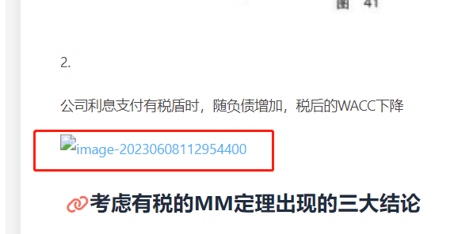
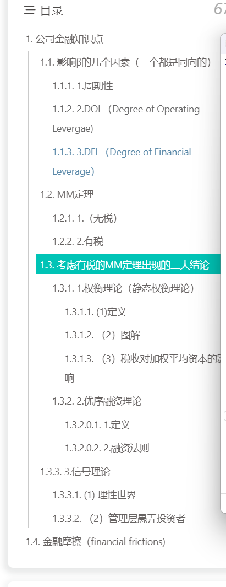

# 用来记录自己学习搭建个人blog的资料&遇到的问题及其解决方法

## 学习资料

[Hexo+阿里云&GitHub 搭建个人博客 | 海拥 (haiyong.site)](http://haiyong.site/post/cda958f2.html)

https://www.fomal.cc/posts/e593433d.html
主题：Butterfly 
[Butterfly 安裝文檔(三) 主題配置-1 | Butterfly](https://butterfly.js.org/posts/4aa8abbe/#代碼高亮主題)

## 目前遇到的问题

### 图挂了



**解决方法**：要使用相对路径“./搭建个人blog的资源-遇到的问题及其解决方法/image-20230917220037303.png”

### 目录是乱的

                          
**解决方法**：直接删除手动加上的数字，“# ##”会自动排序

### 在多台电脑之间使用Git进行数据同步时因为proxy问题报错
出现

```cmd
fatal: unable to access 'XXX': Recv failure: Connection was reset
```

**解决办法：**

1. 依次将如下两条语句复制到git中后，点击回车

   ```python
   git config --global --unset http.proxy 
   git config --global --unset https.proxy
   git config --global http.proxy http://手动设置代理荔枝:端口
   
   ```

   

2. 在cmd中输入（用来清理DNS缓存）

   ```cmd
   ipconfig/flushdns
   ```

3. 正常输入

   ```cmd
   git add .
   git commit -m "xxxx"
   git push
   ```

   

### 多台电脑之间协同工作的方法

摘自：https://xiaorui2.github.io/2019/05/25/Hexo%E5%8D%9A%E5%AE%A2%E5%A4%9A%E5%8F%B0%E7%94%B5%E8%84%91/

思路：**使用git分支**。

# 准备工作和环境要求

在这之前，首先你得有台电脑是配置好了的，也就是确保你已经使用`hexo`在`github pages`上面部署好你的个人博客，并在本地电脑拥有该博客的部署环境，即类似于以下图片的文件目录

[](https://xiaorui2.github.io/2019/05/25/Hexo博客多台电脑/1.png)

# 对username.github.io仓库新建分支，并克隆

在Github的`username.github.io`仓库上新建一个`xxx`分支，并切换到该分支，并在该仓库->`Settings`->`Branches`->`Default branch`中将默认分支设为`xxx`，`save`保存；然后将该仓库克隆（必须要用命令行）到本地，进入该`username.github.io`文件目录。

完成上面步骤后，在当前目录使用`Git Bash`执行`git branch`命令查看当前所在分支，应为新建的分支`xxx`

# 将本地博客的部署文件拷贝进username.github.io文件目录并提交

将本地博客的部署文件全部拷贝进`username.github.io`文件目录，将拷贝进来的博客`hexo`部署环境提交到`xxx`分支，提交之前需注意：将`themes`目录以内中的主题的`.git`目录删除（如果有），因为一个`git`仓库中不能包含另一个`git`仓库，提交主题文件夹会失败。

执行`git add .`、`git commit -m 'back up hexo files'`（引号内容可改）、`git push`即可将博客的hexo部署环境提交到`GitHub`个人仓库的`xxx`分支。现在可以在GitHub上的`*username*.github.io`仓库看到两个分支的差异了。

`master`分支和`xxx`分支各自保存着一个版本，`master`分支用于保存博客静态资源，提供博客页面供人访问；`xxx`分支用于备份博客部署文件，供自己维护更新，保证了两者在一个`GitHub`仓库内互不冲突。至此你搭配好的电脑上的任务就完成了。

# 新电脑环境部署和更新

首先你需要安装一下Hexo：

```
npm install hexo
npm install
npm install hexo-deployer-git --save
```

然后将新电脑的生成的`ssh key`添加到`GitHub`账户上

在新电脑上克隆`username.github.io`仓库的`xxx`分支到本地，此时本地git仓库处于`xxx`分支

切换到`username.github.io`目录，执行`npm install`(由于仓库有一个`.gitignore`文件，里面默认是忽略掉`node_modules`文件夹的，也就是说仓库的`hexo`分支并没有存储该目录[也不需要]，所以需要`install`下.

然后就可以正常的编辑、撰写文章或其他博客更新改动。

依次执行`git add .`、`git commit -m 'back up hexo files'`（引号内容可改）、`git push`指令，保证`xxx`分支版本最新

执行`hexo d -g`指令（在此之前，有时可能需要执行`hexo clean`），完成后就会发现，最新改动已经更新到`master`分支了，两个分支互不干扰！

**注意**：每次**换电脑进行博客更新**时，不管上次在其他电脑有没有更新（就怕更新之后忘了），最好先`git pull`获取`xxx`分支的最新版本，之后再进行编辑和提交。
