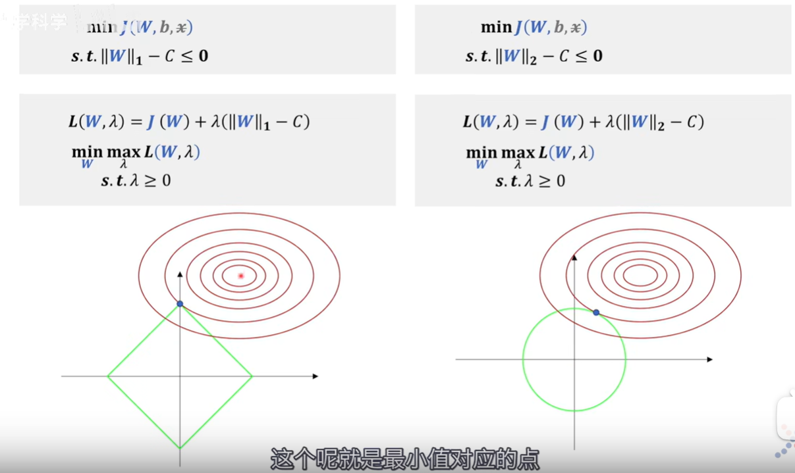

作为非科班出身的金数人，在学习机器学习模型时我发现自对一些最基础、最本质的概念理解不够深入，所以打算写一篇blog，记录一下自己在学习的时候遇到的零零散散的问题。

## 1.极大似然估计(MLE)和损失函数的关系

1. 若变量服从高斯分布，MLE的结果是OLS
2. 若变量服从伯努利分布，MLE的结果是logistich回归
3. 若变量服从多项式分布，MLE的结果是softmax

## 2.当我们对损失函数正则化时，我们在做什么？

做正则化的目的就是为了提高训练出模型的泛化能力。影响模型泛化能力的是权重 $w$ 和偏置 $b$ 。

[“L1和L2正则化”直观理解](https://www.bilibili.com/video/BV1Z44y147xA/?spm_id_from=333.337.search-card.all.click&vd_source=44ba9a7b92cb9c058705d88870afca92)

1. 拉格朗日对偶角度

   

   

   > 为什么说L1正则化（右）可以带来稀疏性，就是因为L1正则化后的极值点容易出现在坐标轴上，而出现在坐标轴上意味着其他某些维度的值为0，比如要用胡子和毛色区分猫咪和狗，L2正则化（左）可能只是赋予两个特征不同的权重，$\lambda$的作用是来调节权重大小，而L1正则化就可能只考虑胡子，而不考虑毛色，这就带来了**稀疏性**。

2. 权重衰减角度

3. 贝叶斯角度

4. 模型复杂度角度