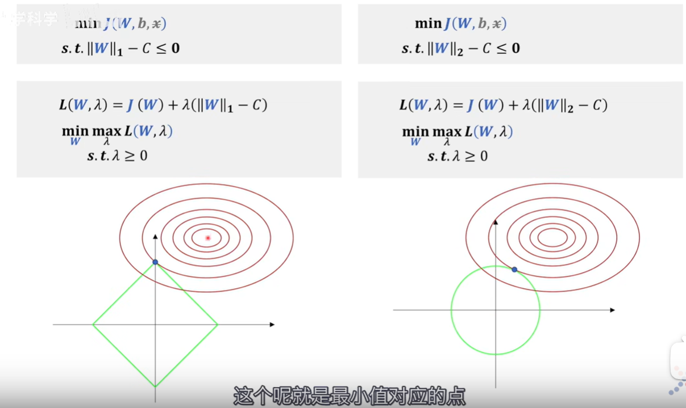
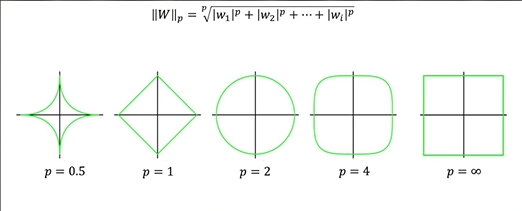
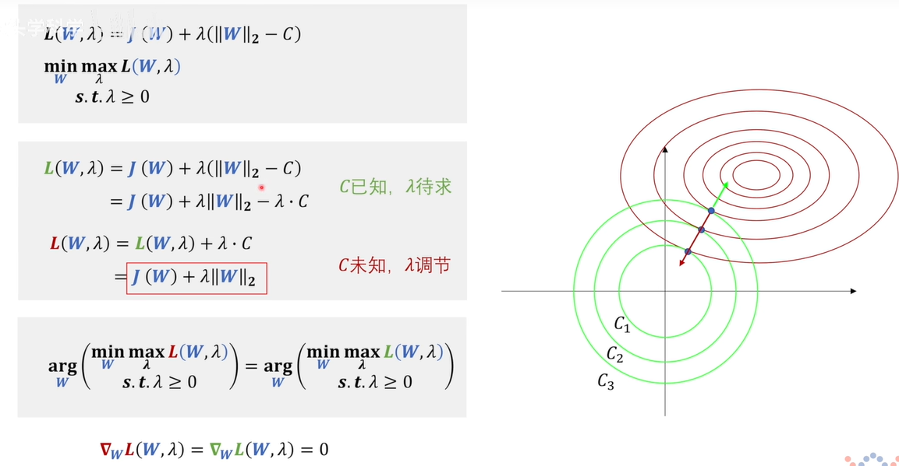
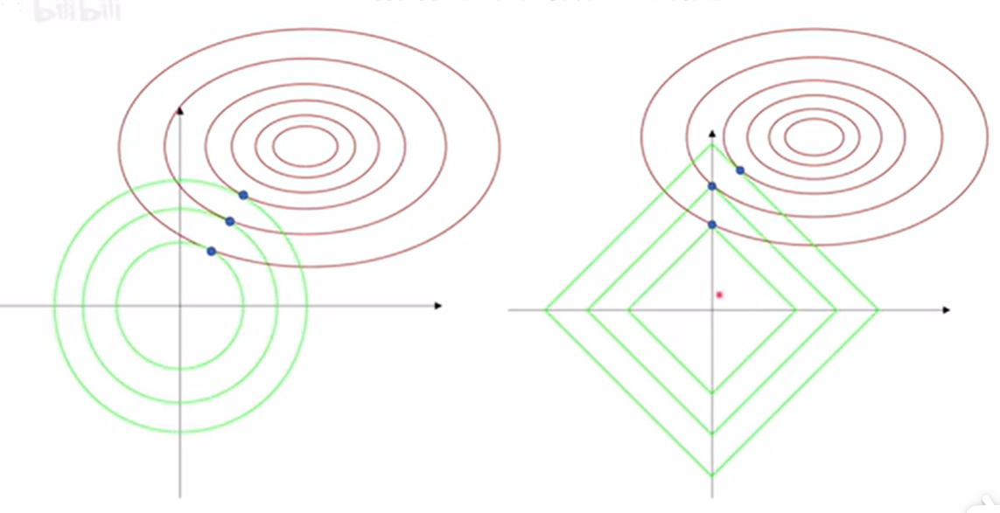

作为非科班出身的金数人，在学习机器学习模型时我发现自对一些最基础、最本质的概念理解不够深入，所以打算写一篇blog，记录一下自己在学习的时候遇到的零零散散的问题。

## 1.极大似然估计(MLE)和损失函数的关系

1. 若变量服从高斯分布，MLE的结果是OLS
2. 若变量服从伯努利分布，MLE的结果是logistic回归
3. 若变量服从多项式分布，MLE的结果是softmax

## 2.当我们对损失函数正则化时，我们在做什么？

做正则化的目的就是为了提高训练出模型的泛化能力。影s响模型泛化能力的是权重 $w$ 和偏置 $b$ 。

参考：[“L1和L2正则化”直观理解](https://www.bilibili.com/video/BV1Z44y147xA/?spm_id_from=333.337.search-card.all.click&vd_source=44ba9a7b92cb9c058705d88870afca92)

### 2.1 拉格朗日对偶角度

所谓正则化，就是在损失函数中加上Lp范数。

   > 为什么说L1正则化（右）可以带来稀疏性，就是因为L1正则化后的极值点容易出现在坐标轴上，而出现在坐标轴上意味着其他某些维度的值为0，比如要用胡子和毛色区分猫咪和狗，L2正则化（左）可能只是赋予两个特征不同的权重，$\lambda$​的作用是来调节权重大小，而L1正则化就可能只考虑胡子，而不考虑毛色，这就带来了**稀疏性**。·+ 
$x$是训练集里面的数据，视作常数不考虑；真正决定拟合效果的是权重$W$，所以偏置$b$虽然是未知参数也不进行研究；
$$
\|W\|_1-C \leq \mathbf{0}
$$
这里可以理解为只考虑对$W$的可行域范围进行约束 。

> 
>
> 只有p>=1的时候，Lp范数才是一个凸集，这时候以Lp范数作为约束的问题才能是一个凸优化问题；反之，若0<p<1，集合就是非凸集。

 **我们看到的L2正则化的函数和原问题的拉格朗日函数之间的关系**

在这个问题中，红的的函数与绿色相比，少了一个$\lambda$$C$，这个C其实调节的是圆半径的大小，在绿色函数中，就是C视为已知，来求$\lambda$；而在红色函数中，是用$\lambda$来调节圆的半径，每一个极值点都对应一对共线相反大小相等的梯度，对应一个特别的$\lambda$，也就是对应一个半径C（即可以通过调节$\lambda$来调节$C$。

红色和绿色两个函数对$W$求梯度后，得到的W值是相等的，因为$\lambda$$C$在对$W$求导的时候为0。看似这两个问题是等价的，但是其实超参数已经改变了，上面的超参数是$C$，下面的是$\lambda$。

**L1正则化和L2正则化的特性**：

L1正则化会带来稀疏性。（待补充）

> 为什么说L1正则化（右）可以带来稀疏性，就是因为L1正则化后的极值点容易出现在坐标轴上，而出现在坐标轴上意味着其他某些维度的值为0，比如要用胡子和毛色区分猫咪和狗，L2正则化（左）可能只是赋予两个特征不同的权重，$\lambda$的作用是来调节权重大小，而L1正则化就可能只考虑胡子，而不考虑毛色，这就带来了**稀疏性**。

## 3.树模型

### 3.1 基础的树

李航统计学习上比较基础的树模型：ID3 C4.5 CART

三者区别：

- **划分标准的差异：**ID3 使用信息增益偏向特征值多的特征，C4.5 使用信息增益率克服信息增益的缺点，偏向于特征值小的特征，CART 使用基尼指数克服 C4.5 需要求 log 的巨大计算量，偏向于特征值较多的特征。
- **使用场景的差异：**ID3 和 C4.5 都只能用于分类问题，CART 可以用于分类和回归问题；ID3 和 C4.5 是多叉树，速度较慢，CART 是二叉树，计算速度很快；
- **样本数据的差异：**ID3 只能处理离散数据且缺失值敏感，C4.5 和 CART 可以处理连续性数据且有多种方式处理缺失值；从样本量考虑的话，小样本建议 C4.5、大样本建议 CART。C4.5 处理过程中需对数据集进行多次扫描排序，处理成本耗时较高，而 CART 本身是一种大样本的统计方法，小样本处理下泛化误差较大 ；
- **样本特征的差异：**ID3 和 C4.5 层级之间只使用一次特征，CART 可多次重复使用特征；
- **剪枝策略的差异：**ID3 没有剪枝策略，C4.5 是通过悲观剪枝策略来修正树的准确性，而 CART 是通过代价复杂度剪枝。

### 3.2 基于集成学习的改进

**基于Bagging算法典型代表**

随机森林（Random Forest）

**基于Boosting算法典型代表**

如AdaBoost、GBDT、XGBoost等。

> 1）Bagging + 决策树 = 随机森林
>
> 2）AdaBoost + 决策树 = 提升树
>
> 3）Gradient Boosting + 决策树 = GBDT

**那么Bagging和Boosting的区别是什么呢？**

1）样本选择：

Bagging：训练集是在原始集中有放回选取的，从原始集中选出的各轮训练集之间是独立的。

Boosting：每一轮的训练集不变，只是训练集中每个样例在分类器中的权重发生变化。而权值是根据上一轮的分类结果进行调整。

**基于这个性质我们可以知道，Bagging后的bias与单模型接近，而variance能显著下降，每个基模型之间是独立的。**

2）样例权重：

Bagging：使用均匀取样，每个样例的权重相等

Boosting：根据错误率不断调整样例的权值，错误率越大则权重越大。

3）预测函数：

Bagging：所有预测函数的权重相等。

Boosting：每个弱分类器都有相应的权重，对于分类误差小的分类器会有更大的权重。

4）并行计算：

Bagging：各个预测函数可以并行生成

Boosting：各个预测函数只能顺序生成，因为后一个模型参数需要前一轮模型的结果。

5）适用场景：

Bagging: High Variance & Low Bias 

Boosting: Low Variance & High Bias 
