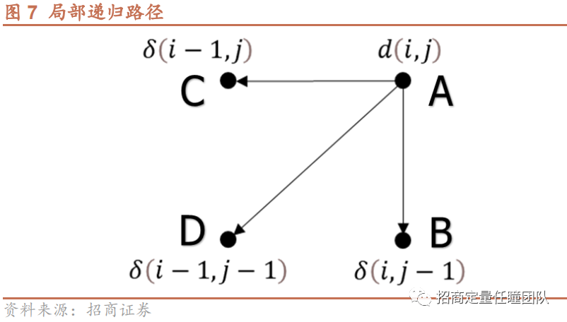

1.东财数据+供应链数据

2.对东财数据降噪处理，计算簇内

3.在某一个时间节点，我们回看过去已知的概念数据or供应链数据

机器学习做出来的效果不好，所以尝试对数据进行降噪处理

# 11.27

### 具体操作

将概念算出来之后，得到每一天每个概念内股票的关系强度（比如等权的pearson系数），和宽基指数内的关系强度进行对比。
可以尝试将concept内关系最弱的股票剔除，看概念内股票的关系有没有明显增强。

### 先上手计算欧氏距离

欧氏距离为常见的计算时间序列相似度的方法，该方法可以直接衡量两个时间序列之间的距离，其计算公式为:
$$
D=\sqrt{\sum_{i=1}^N\left(X_i-Y_i\right)^2}
$$

其中 $\mathrm{N}$ 为序列 $\mathrm{X}$ 和序列 $\mathrm{Y}$ 的长度。
由上述公式可以看出, 若要计算两个序列之间的欧氏距离, 有两个局限性:
1、两个序列的长度需要相同, 但在实际研究工作中, 找到满足上述条件的序列并非易事。
2、该方法也无法进行异步相似度计算，因此会对实际上较为相似的两个时间序列其相似性做出误判。

### further discussion

1.能不能做成因子

2.使用分钟频的数据是否会更有效？（or selected minute frequency，比如volatility集聚现象重合）

# 11.28

从过往研究来看，度量时间序列相似性的方法大致分为4类：

第一类为**基于特征的相似性度量方法**，如相关系数、互信息等；
第二类为**锁步（时间序列“一对一”比较）的距离度量方法**，典型方法有闵可夫斯基距离（可衍生为曼哈顿距离、欧氏距离、切比雪夫距离）、Hausdorff距离、余弦相似度等；
第三类为**弹性（允许时间序列“一对多”比较）的距离度量方法**，代表方法为动态时间弯曲距离（DTW）、编辑距离（EDR）、最长公共子序列（LCSS）；
第四类方法关注时间序列的**变化相似性**，如ARMA、HMM等。

## DTW

### 定义

对于时间序列 $X$ 和 $Y$ ，定义非负函数 $f$ 来衡量时间序列中的点 $x \_$i和点 $y$ j的距离:
$$
d(i, j)=f\left(x_{-} i, y \_j\right) \geq 0,
$$

除常见的欧氏距离外，距离函数f也可以选取余弦相似度、汉明距离、曼哈顿距离、切比雪夫距离等其他距离度量方法。如果时间序列是多维的，则将每个维度的距离相加即可（确保各维度量纲一致）。

定义了时间序列中点与点的距离之后，两段时间序列即可形成一个 $N \times M$ 的点阵，从点阵的右上角到左下角可以形成一条弯曲路径 (Warping Path)。

给定弯曲路径之后，便可以计算时间序列X和Y的标准化累计时间弯曲距离。另外，为了确保弯曲路径的合理性，通常需要满足 3 大基本条件:
- 终点条件 (Endpoint Constraints)：要求弯曲路径的起点和终点必须为点阵平面的对角单元；
- 连续性条件 (Local Continuity Constraints)：要求弯曲路径的每一步为相邻的单元（包括对角相邻单元)；
- 单调性条件 (Monotonicity Conditions)：由于语音序列或证券交易数据等时间序列是有时序性的 (时间不可倒流)，所以从实际意义出发，弯曲路径在点阵图上必须是单调的。

显然，满足以上3个条件的路径有很多条，选取哪条路径来计算DTW距离呢? 一个很自然的想法是选取使得DTW 距离最小的路径，具体推导过程需要利用动态规划算法（Dynamic Programming），这里不展开说明。最后，使得DTW距离最小化的最佳匹配路径需满足如下递归条件：
$$
\delta(i, j)=d(i, j)+\min [\delta(i-1, j), \delta(i-1, j-1), \delta(i, j-1)]
$$

### **传统的DTW算法存在两点缺陷**

.png)

1）算法对时间序列进行伸缩和平移时，可能存在过度伸缩或平移，产生时间序列点之间的“病态匹配”，如图8所示，B为两段时间序列的真实匹配情况，C为DTW算法下的匹配结果，显然较不合理，某些地方被过度平移和伸缩了

2）传统DTW算法运算量较大，时间复杂度较高。对于择时策略本身而言，显然第一个问题更加重要，如果不是高频策略，则运算复杂度对策略的影响不大，我们更关注距离度量的精度和策略实际效果。本节将针对“病态匹配”的问题对DTW算法做出改进，以提升匹配精度和策略效果。

-----

### “病态匹配”的改进方向：

加权DTW算法（Weighted Dynamic Time Warping，WDTW）、导数DTW算法（Derivative Dynamic Time Warping，DDTW）、步模式（Step Pattern）、全局约束（Global Constraints）

#### (1) 全局约束 (Global Constraints)

**限制匹配路径尽可能接近对角线**、**对匹配路径整体进行限制**

传统的DTW算法允许匹配路径可以在图6中的点阵中任意生成（需满足上一节的3个基本条件），全局约束要求匹配路径只能在限定的区域内生成，常用的全局约束方法有Sakoe-Chiba Constraint和Itakura Parallelogram等。
Sakoe-Chiba Constraint，需设定窗口限制参数r，即最佳匹配路径须在距点阵对角线距离为r的区域内；Itakura Parallelogram将匹配路径限定在一个平行四边形区域中，平行四边形的四条边的斜率分别为2和0.5。

#### **(2) 局部约束（Local Constraints）**

**对匹配路径中每一步进行约束**

##### a.**步模式**

**放松连续性条件，即可以与不相邻的点匹配，便能形成新的递归方式，即步模式**.png)

##### b.**加权方式**

-1701157416807-7.png)

模型有2个主要参数：序列长度l和距离阈值k，其中距离阈值k设置目的是当筛选相似的历史序列时，选取距离小于k的历史序列。若k选取过小，则会遗漏相似的历史序列；若k选取过大，则实际上不相似的历史序列也会被选入。

### 我的问题：

1.能否利用聚类算法通过计算出DTW的相关度从而二次聚类？

做法参考：https://mp.weixin.qq.com/s/ODXny7pqV12LQ59TDkFkcQ